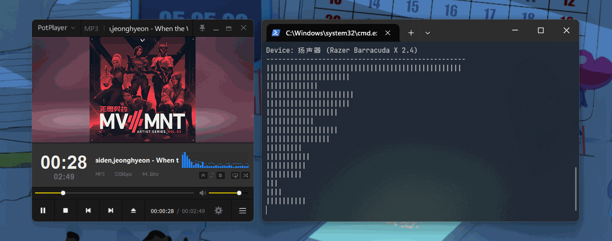

# Node-Windows-Audio-Visualisation

<a href="https://github.com/LeagueTavern/node-windows-audio-visualisation/issues"></a>
<a href="https://github.com/LeagueTavern/node-windows-audio-visualisation/actions"></a>
<a href="https://nodejs.org/en/about/releases/"></a>
<a href="https://www.npmjs.com/package/@coooookies/windows-audio-visualisation"></a>
<a href="https://npmcharts.com/compare/@coooookies/windows-audio-visualisation?minimal=true"></a>



> 本库诞生的初衷，是为了解决无法在 [Electron](https://www.electronjs.org/) 和 [Node.js](https://nodejs.org/) 中无法访问 Windows 扬声器的音频可视化数据的问题，本库在解决问题的基础上，提供了简单的 API 来访问这些数据。使用了 [napi-rs](https://napi.rs/) 来实现了对本库进行 Native Addon 的封装，由 [Rust](https://www.rust-lang.org/) 强力驱动。

[English](./README.md) | 简体中文

## ⚠️ 注意

`node-windows-audio-visualisation` 目前仅支持 Windows 平台

## 🚀 功能

- 轻松获取 Windows 音频可视化数据
- 支持 JavaScript 和 TypeScript
- 易于使用和集成到现有的 Node.js 应用程序中

## 安装

```shell
npm i @coooookies/windows-audio-visualisation
```

## 🍊 来点栗子

[CommonJS Example](example/index.js) <br />
[ESModule Example](example/index.mjs) <br />
[TypeScript Example](example/index.ts) <br />

## 使用

#### 引入本库

```Typescript
// Typescript & ESModule
import { AudioMonitor, getDefaultOutputDevice, getAllOutputDevices } from '@coooookies/windows-audio-visualisation';

// CommonJS
const { AudioMonitor, getDefaultOutputDevice, getAllOutputDevices } = require('@coooookies/windows-audio-visualisation');
```

#### 获取所有输出设备

获取本系统所有的输出设备

```Typescript
const devices = getAllOutputDevices(); // AudioDevice[]
// [
//   {
//     id: "abcdefghijk"
//     name: "Speakers (Realtek High Definition Audio)"
//     sampleRate: 44100
//     bufferSize?: 2048
//     isDefault: true
//   },
//   {
//     ...
//   }
// ]
```

#### 获取默认输出设备

获取本系统默认的输出设备

```Typescript
const device = getDefaultOutputDevice(); // AudioDevice | null
// {
//   id: "abcdefghijk"
//   name: "Speakers (Realtek High Definition Audio)"
//   sampleRate: 44100
//   bufferSize?: 2048
//   isDefault: true
// }
```

#### 使用 AudioMonitor 实例

获取音频可视化数据，音频可视化数据是一个数组，数组的长度是音频可视化的频谱容器长度，单个容器单位的数值代表音频可视化单元的响度，值范围是 0 到 1。

```Typescript
const audio = new AudioMonitor()

audio.setDevice("abcdefghijk") // 设置音频设备Id
audio.play() // 开始监控音频数据

// audio.pause() // 暂停监控音频数据

const length = 20
const bands = 8
const dancy = 12

const spectrum = audio.getSpectrum(bands, dancy, 1024)
// [0.521, 0.821, 0.123, 0.456, 0.789, 0.234, 0.567, 0.890, ...]

setInterval(() => {
  console.log(audio.getSpectrum(bands, dancy, 1024))
}, 1e3 / 20)
// [0.521, 0.821, 0.123, 0.456, 0.789, 0.234, 0.567, 0.890, ...]
// [0.123, 0.456, 0.789, 0.234, 0.567, 0.890, 0.123, 0.456, ...]
// [0.789, 0.234, 0.567, 0.890, 0.123, 0.456, 0.789, 0.234, ...]
// ...
```

## 协议

此项目使用 [MIT](LICENSE) 许可证进行许可。

- [@RustAudio/cpal (Apache-2.0 license)](https://github.com/RustAudio/cpal)
- [@Ricky12Awesome/safav (Apache-2.0 license)](https://github.com/Ricky12Awesome/safav)
